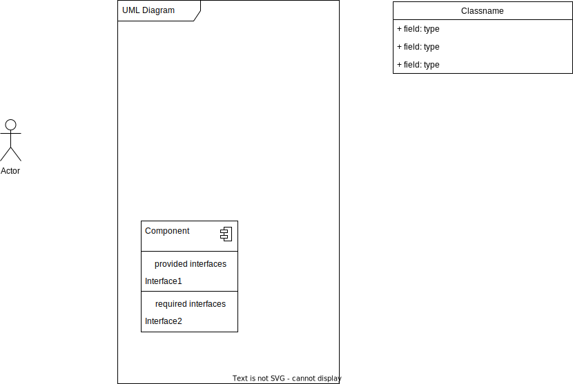

# UGAthens Transit

## Desription:
As students, traveling across campus and throughout Athens is something we do daily. The Athens and UGA Transit systems offer a free and convenient alternative for those without cars as well as those who prefer to avoid the hassle of driving and parking on and off campus. Securing a parking spot on campus is both expensive and very competitive, so taking advantage of free public transportation is a great option for those who live off campus.  
One of the biggest challenges of utilizing public transportation in Athens is understanding and managing the different bus routes and stops. While both the Athens and UGA Transit tracking websites are helpful, needing to switch between the two when trying to find the most efficient route to take can be both overwhelming and time-consuming.  
The UGAthens Transit website aims to address these challenges by providing Athens residents with a more accessible way to navigate UGA’s campus and the city, ultimately enhancing their public transportation experience. By making public transportation easy to navigate, we hope to encourage those who live in Athens to try taking the bus for the first time or use Athens public resources more often.  

It is the goal of this project to create a working, functional website that effectively combines UGA and Athens Transit data in a way that satisfies potential users.
This team defines project goals to be:
- Ability for users to select a route and see all stops on that route as well as all active buses
- Ability for users to select a stop and see all routes that stop there
- Ability for users to login via SSO and save favorite bus routes and stops

## UML Diagram:

Not Completed yet! - Ryan

To edit this file, add [hediet.vscode-drawio](https://marketplace.visualstudio.com/items?itemName=hediet.vscode-drawio) Extention to VS Code
